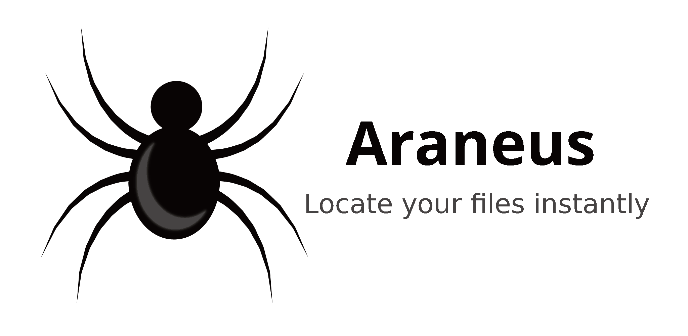

# Freezing

---

**This app is under development.**

# Docmentations

> Instructions and examples will be available in the first release.

# Dependencies

- GNU/Linux
- Python>=3.6
- The app requires these packages to run:
  > Use `which <package>` to verify it exists.
  - `pkexec` or `kdesu` or `kdsudo`.
  - `strings`
  - `grep`
  - `tail`
  - `cut`
  - `updatedb`
  - `locate`

# Installation

> Instructions and examples will be available in the first release.

# Building

> Instructions and examples will be available in the first release. 
>Logo was designed by CARLOS ALBERTO ESPITIA REYES from [pngtree.com](https://pngtree.com/freepng/vector-cartoon-black-spider_2441240.html)
